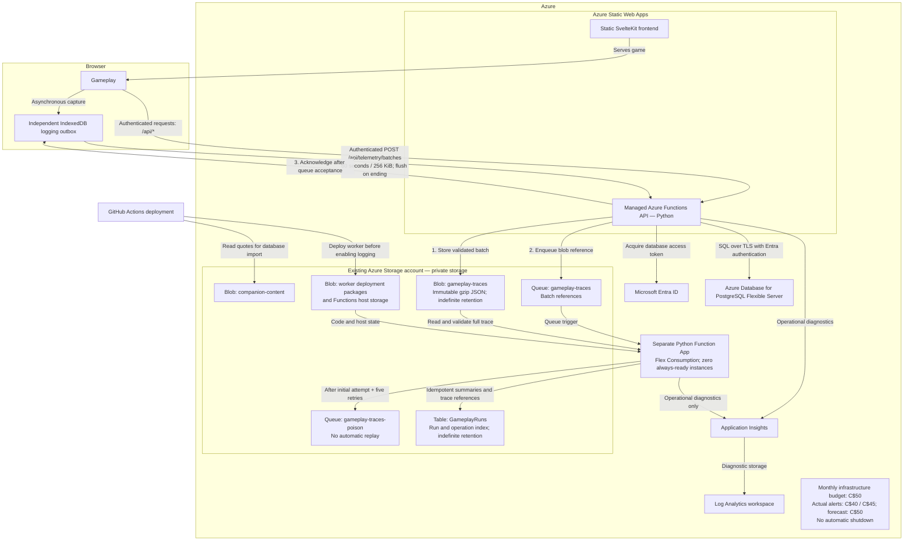

# Virtual Pet

A static, session-only companion-care game built with SvelteKit and strict
TypeScript. A run supports Realtime and Streaming clocks, deterministic care and
autonomous events, a 226-item shop and inventory, room placement, persistent
statuses, streaming income and career progression, background projects,
complete in-memory history, and terminal graveyard presentation.

The app uses password accounts while game runs remain browser-session-only.
After authentication, the player reaches a separate game-key page. Existing
eight-digit keys open their sessions directly; generating a new key leads to a
visible confirmation of that key before the player continues to a separate
clock-mode page. There is no in-app reset, restart, recovery, or mode switch.
Runs do not inherit keepsakes, debt, Followers, or unlocks.

## Azure infrastructure

The diagram shows the infrastructure defined in this repository, including the
gameplay logging pipeline. It describes the configured architecture, not deployment
status; browser capture and ingestion are enabled separately after worker deployment.



## Requirements

- Node.js 24.14.0
- Corepack-enabled pnpm 11.22.0

## Run locally

```sh
corepack enable
pnpm install
pnpm dev
```

For the static production build:

```sh
pnpm build
pnpm preview
```

## Verification

```sh
pnpm validate:data
pnpm validate:assets
pnpm validate:product
pnpm check
pnpm lint
pnpm format
pnpm test
pnpm build
pnpm test:e2e
```

Catalogue nutrition and behavior are authored under
`src/lib/data/catalogue/` and compiled into the bundled game definition. All
gameplay uncertainty is derived from the displayed run seed; the simulation
does not use `Math.random()`.

The catalogue contains 110 Food, 2 Medicine, 3 Care, 73 Reusable, 23 Upgrade,
and 15 Decoration items. Nutrition research and exact primary-source records
are documented in `docs/research/FOOD_NUTRITION_SOURCES.md`.

See `docs/GAME_RULES.md` for the player-facing rules,
`docs/RULES_AND_FILES.md` for source ownership, and `CONTEXT.md` for the domain
vocabulary.
