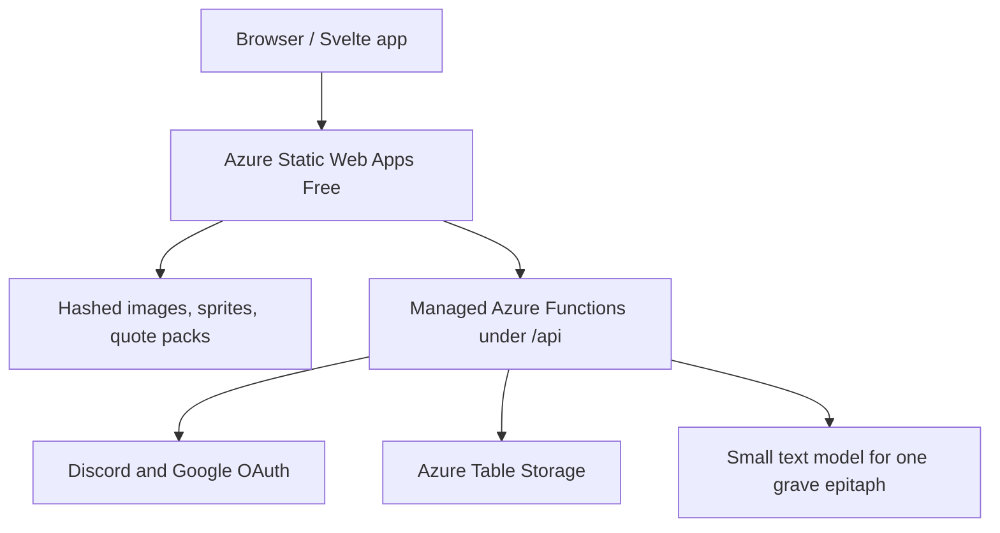

# Bri Virtual Pet — Backend Functions and Terraform Infrastructure Spec

**Status:** DRAFT IMPLEMENTATION SPEC  
**Date:** 2026-08-26  
**Companion gameplay rules:** `GAME_RULES.md`  
**Purpose:** Define the persistence API, Azure Functions behavior, Azure Table Storage layout, static asset hosting, runtime AI epitaph flow, and Terraform-owned infrastructure. Hand this file to a coding model together with the gameplay spec.

---

## 1. Scope and authority

This document owns:

- the browser-to-backend API contract;
- account, game, event, and grave persistence;
- optimistic concurrency across devices;
- permanent death finalization;
- AI-generated grave text;
- static asset delivery decisions;
- Terraform resources, settings, outputs, and safeguards;
- deployment and infrastructure validation requirements.

The companion gameplay spec remains authoritative for:

- stat decay;
- autonomous events;
- seeded gameplay randomness;
- inventory effects;
- status behavior;
- passage-of-time reconciliation;
- follower and money formulas;
- death eligibility and deterministic death causes;
- all other simulation rules.

If the two documents conflict, use this rule:

> The gameplay spec owns what happens in the game. This spec owns how the resulting state is stored, synchronized, finalized, and deployed.

The statement in the gameplay spec that no server migration is required describes the current session-memory baseline. Implementing this document intentionally replaces that baseline with persisted cloud state.

### Current implementation slice

The current backend pass implements password-only accounts and provisions `Users`, `AuthRecords`, `GameData`, `ShopItems`, and `GlobalRules`. `GameData` is provisioned but unused while gameplay remains session-only. Shop and global rule records are synchronized by CI and are not consumed by the frontend. Email recovery, OAuth, persisted games, graves, AI generation, and operational counters are not part of this pass.

---

## 2. Non-negotiable architecture decisions

### 2.1 The frontend owns the simulation

The browser remains the simulation engine.

The backend must not independently resolve:

- elapsed-time decay;
- passive income;
- follower multipliers;
- autonomous events;
- status ticks;
- item effects;
- death causes;
- seeded gameplay RNG.

The backend provides:

- a trusted `serverNow` timestamp;
- schema validation;
- compare-and-swap persistence;
- append-only event storage;
- lifecycle enforcement for active versus dead games;
- grave text generation after death is committed.

Derived values should not be persisted when they can be reproduced from canonical state plus `rulesVersion`. Canonical inputs and all state required for deterministic reconciliation must be persisted.

### 2.2 Use real accounts; game hashes are not credentials

Every player has one account with:

- one globally unique, case-insensitive username;
- one account password shared across all lives owned by that account;
- a verified recovery email so the password can be reset;
- optional Discord and Google identities as additional sign-in methods;
- one server-side authentication session per signed-in device.

The term **master password** means the account password. It must never mean one site-wide password shared by multiple users.

Game hashes are identifiers comparable to save names. They are not passwords, authentication sessions, recovery codes, or authorization tokens. Knowing a hash does not authorize reading or changing an active game owned by another user.

Do not use Azure Function keys as browser credentials. Do not add Entra External ID, Cognito, Auth0, or another managed identity platform in the first release.

### 2.3 One account can own multiple permanent lives

The required relationship is:

```text
Account 1 -> N Games
Game    0 -> 1 Grave
```

- `userId` is globally unique.
- `username` is globally unique after normalization.
- `gameHash` is globally unique across all games.
- A user can create another game after a death.
- An existing game is never reset or reused.
- A dead game is permanently read-only.
- A user can list every owned game hash and revisit multiple graves from earlier lives.

### 2.4 Terraform provisions infrastructure; it does not generate application code

Terraform owns Azure resources and runtime configuration.

The repository owns:

- Azure Functions TypeScript source;
- frontend source;
- `staticwebapp.config.json`;
- static assets and quote packs;
- build and deployment workflows.

Do not embed Function implementation logic in Terraform provisioners, `local-exec`, ARM deployment scripts, or generated source files.

### 2.5 Keep the first deployment cheap

The initial architecture must not include:

- Azure API Management;
- Azure Front Door;
- AWS Lambda or Lambda Layers;
- a standalone App Service plan;
- a standalone Function App;
- Cosmos DB;
- Azure DocumentDB;
- Azure SQL;
- Redis;
- a queue for grave generation;
- a separate CDN;
- runtime AI for ordinary interactions.

These services are not justified for 10–300 expected users and a target below **$50 CAD/month**.

Authentication remains in the existing Azure Functions API. Mixing AWS compute with Azure Table Storage would add cross-cloud latency, credentials, egress, and a second failure boundary without solving a product requirement.

---

## 3. Runtime and toolchain baseline

Use these implementation baselines unless the repository already pins a compatible newer patch:

| Component                              | Baseline | Release information                                                                                                         |
| -------------------------------------- | -------- | --------------------------------------------------------------------------------------------------------------------------- |
| Azure Functions runtime                | 4.x      | Required by the Node.js v4 programming model                                                                                |
| Node.js                                | 22.23.1  | Node 22 first released 2024-04-24; 22.23.1 released 2026-07-28; supported by Static Web Apps managed Functions as `node:22` |
| Azure Functions Node programming model | v4       | Define functions in TypeScript with `@azure/functions`; do not create v3-style per-function `function.json` files           |
| Passport core, if used                 | 0.7.0    | Published 2023-11-27; optional authentication-strategy adapter, not the session or database layer                           |
| Terraform CLI                          | 1.16.x   | Terraform 1.16.0 released 2026-08-26                                                                                        |
| AzureRM provider                       | 5.2.x    | AzureRM 5.2.0 released 2026-08-20                                                                                           |

Terraform constraints should be equivalent to:

```hcl
terraform {
  required_version = "~> 1.16.0"

  required_providers {
    azurerm = {
      source  = "hashicorp/azurerm"
      version = "~> 5.2"
    }
  }
}
```

Use the repository lockfile for exact npm package patches. Pin CI actions to immutable commit SHAs rather than floating branches.

Authoritative references:

- [Static Web Apps supported runtimes](https://learn.microsoft.com/en-us/azure/static-web-apps/languages-runtimes)
- [Static Web Apps API overview](https://learn.microsoft.com/en-us/azure/static-web-apps/apis-overview)
- [Static Web Apps managed Functions constraints](https://learn.microsoft.com/en-us/azure/static-web-apps/apis-functions)
- [Azure Table Storage design](https://learn.microsoft.com/en-us/azure/storage/tables/table-storage-design)
- [Passport sessions](https://www.passportjs.org/concepts/authentication/sessions/)
- [Google OpenID Connect](https://developers.google.com/identity/openid-connect/openid-connect)
- [Discord OAuth2](https://discord.com/developers/docs/topics/oauth2)
- [OWASP password storage guidance](https://cheatsheetseries.owasp.org/cheatsheets/Password_Storage_Cheat_Sheet.html)
- [Terraform `azurerm_static_web_app`](https://registry.terraform.io/providers/hashicorp/azurerm/latest/docs/resources/static_web_app)
- [Terraform releases](https://github.com/hashicorp/terraform/releases)
- [AzureRM provider releases](https://github.com/hashicorp/terraform-provider-azurerm/releases)

---

## 4. Target architecture



### Request flow

1. Static Web Apps serves the frontend, images, sprite sheets, and versioned quote packs.
2. The frontend calls same-origin endpoints under `/api`.
3. Authentication Functions handle username/password, Discord OAuth, Google OpenID Connect, password reset, and server-side session cookies.
4. Managed Azure Functions validate account ownership and persist state in Azure Table Storage.
5. Table ETags prevent stale writes from a second browser or device.
6. The frontend resolves elapsed time from the persisted state to the returned `serverNow`.
7. On death, the backend atomically freezes the life and creates a pending grave.
8. Only after that commit may the backend call the configured small text model to generate the epitaph.

The `/api` route is fixed by Static Web Apps. No API gateway or CORS layer is required.

---

## 5. Repository layout

Use the existing repository structure where possible. The intended additions are equivalent to:

```text
api/
  host.json
  local.settings.example.json
  package.json
  tsconfig.json
  src/
    index.ts
    functions/
      register.ts
      login.ts
      logout.ts
      forgot-password.ts
      reset-password.ts
      verify-email.ts
      resend-verification.ts
      oauth-discord.ts
      oauth-google.ts
      oauth-callback.ts
      complete-oauth-account.ts
      get-current-user.ts
      list-user-games.ts
      create-game.ts
      get-game.ts
      update-game.ts
      finalize-death.ts
      list-graves.ts
      get-grave.ts
      health.ts
    domain/
      api-types.ts
      persistence-types.ts
      schemas.ts
      errors.ts
    persistence/
      table-client.ts
      user-repository.ts
      auth-record-repository.ts
      game-repository.ts
      counter-repository.ts
    auth/
      account-service.ts
      password-service.ts
      session-service.ts
      oauth-service.ts
      recovery-service.ts
      email-adapter.ts
    grave/
      epitaph-service.ts
      epitaph-prompt.ts
      epitaph-fallback.ts
      model-adapter.ts

infra/
  bootstrap/
  modules/
    app/
  environments/
    prod/

staticwebapp.config.json
```

The exact folder names may follow an existing monorepo convention, but the separation between HTTP handlers, persistence, domain validation, and AI generation must remain.

---

## 6. Identifier rules

### 6.1 Username and user ID

- Every account has a server-generated opaque `userId`.
- Every account also has one unique username chosen by the user.
- Normalize usernames before storage and lookup.
- Restrict the canonical username to a simple documented character set such as lowercase ASCII letters, digits, and underscore.
- Use the normalized username directly as the `Users` row key; do not create a separate username index.
- Usernames are immutable in the first release. A rename workflow is deferred.
- A display name may be stored separately and does not need to be unique.

Example:

```text
username = pierre
userId   = f9b0b43d-2cd7-43c7-a8c6-baf408cfb20f
```

### 6.2 Account password

- Each completed account has one account password that authorizes access to all games owned by that account.
- Store only a salted password hash and its algorithm parameters.
- Prefer Argon2id. Node's built-in asynchronous `crypto.scrypt` is an acceptable serverless alternative that avoids native binary layers.
- Never store or log the plaintext password.
- Never call the password a game hash, session hash, or Function key in code.

### 6.3 Authentication session ID

- Generate at least 32 random bytes per login session.
- Put the opaque token only in an `HttpOnly`, `Secure`, `SameSite=Lax` cookie.
- Store only a SHA-256 hash of the token in `AuthRecords`.
- Give each device its own expiring session.
- A game hash must never be accepted as an authentication-session token.

### 6.4 Game hash

- Generate an eight-digit numeric string on the server.
- Preserve leading zeroes; never parse it as a number.
- Use cryptographically strong identifier randomness such as `crypto.randomInt`.
- Gameplay's seeded-RNG requirement does not apply to external identifiers.
- Enforce global uniqueness through conditional insertion of the canonical `STATE` entity.
- On `409 Conflict`, generate another key and retry.
- Fail with `503 GAME_HASH_RETRY_EXHAUSTED` after 20 collisions rather than looping forever.

Example:

```text
00421873
```

The hash has low entropy and can be enumerated. That is accepted because it is a name/locator rather than a protected credential. Active-game reads and every mutation still require an authenticated owner session.

### 6.5 Death ID

- Generate a UUID when death is finalized.
- One game can have at most one `deathId`.
- The ID makes grave generation and retries idempotent.

---

## 7. Azure Table Storage model

Create these five tables:

| Table         | Purpose                                                                                       |
| ------------- | --------------------------------------------------------------------------------------------- |
| `Users`       | Account profile, password hash, recovery information, and owned game hashes                   |
| `AuthRecords` | OAuth identity mappings, login sessions, password-reset tokens, and email-verification tokens |
| `GameData`    | Canonical current state, immutable event segments, canonical graves, and operational rows     |
| `ShopItems`   | One canonical compiled catalogue row per stable item ID                                       |
| `GlobalRules` | Versioned runtime JSON documents synchronized from the repository                             |

Do not create one table per player or one table per game.

### 7.1 `Users`

| Property                | Value                                                                  |
| ----------------------- | ---------------------------------------------------------------------- |
| `PartitionKey`          | `"USER"`                                                               |
| `RowKey`                | Normalized unique username                                             |
| `userId`                | Server-generated opaque account ID                                     |
| `displayName`           | Optional player-facing name                                            |
| `passwordHash`          | Salted password hash plus algorithm parameters                         |
| `recoveryEmail`         | Normalized recovery address                                            |
| `recoveryEmailVerified` | Boolean                                                                |
| `gameHashesJson`        | JSON array of every game hash owned by the account                     |
| `linkedProvidersJson`   | JSON array containing `discord` and/or `google` when explicitly linked |
| `createdAt`             | ISO-8601 UTC timestamp                                                 |
| `updatedAt`             | ISO-8601 UTC timestamp                                                 |
| `schemaVersion`         | User entity schema version                                             |

At this scale, a constant partition is acceptable. Conditional creation of this entity enforces username uniqueness. Do not add a separate `UsernameIndex` table.

`gameHashesJson` is the authoritative ownership list. Azure Table Storage does not store a native nested JSON document; serialize the array into one string property. The expected number of lives per user is far below the property-size limit.

Adding a game hash requires an ETag-protected read/append/write of the `Users` entity. If another request updated the user first, reload and retry the append. Never replace the list without an ETag.

Do not create a `UserGames` or `PlayerGames` table.

### 7.2 `AuthRecords`

Use one table with entity types separated by partition key:

| Record                 | `PartitionKey`  | `RowKey`                                 | Required values                                                     |
| ---------------------- | --------------- | ---------------------------------------- | ------------------------------------------------------------------- |
| Discord identity       | `OAUTH#DISCORD` | Discord user ID                          | `username`, `userId`, timestamps                                    |
| Google identity        | `OAUTH#GOOGLE`  | Google OIDC `sub`                        | `username`, `userId`, timestamps                                    |
| OAuth state/onboarding | `OAUTH_STATE`   | SHA-256 of random state/onboarding token | `provider`, pending provider subject/profile, `expiresAt`, `usedAt` |
| Login session          | `SESSION`       | SHA-256 of random session token          | `username`, `userId`, `expiresAt`, `createdAt`                      |
| Password reset         | `RESET`         | SHA-256 of random reset token            | `username`, `userId`, `expiresAt`, `usedAt`                         |
| Email verification     | `VERIFY_EMAIL`  | SHA-256 of random verification token     | `username`, `userId`, `email`, `expiresAt`, `usedAt`                |

This is not a username index. It is required because OAuth callbacks, session cookies, and reset links begin with provider/token identifiers rather than the local username.

Rules:

- Never store raw session, reset, or email-verification tokens.
- Do not persist provider access or refresh tokens when the provider is used only for sign-in.
- Reject expired or already-used reset/verification records.
- Delete expired sessions opportunistically during authentication and account activity; Azure Table Storage does not provide automatic TTL.
- Do not scan `Users` and parse every row during an OAuth login.
- An OAuth identity maps to at most one local account.
- Never auto-link accounts based only on matching email. Linking an additional provider requires an already authenticated account or an explicit account-completion flow.

### 7.3 `GameData`

Every entity for one life shares the game hash as its partition:

```text
PartitionKey = gameHash
```

This allows the state update and its newly appended event segment to use one atomic Entity Group Transaction.

#### Current state entity

| Property             | Value                                                     |
| -------------------- | --------------------------------------------------------- |
| `PartitionKey`       | `gameHash`                                                |
| `RowKey`             | `STATE`                                                   |
| `ownerUserId`        | Owning account ID                                         |
| `ownerUsername`      | Normalized owner username for direct authorization checks |
| `lifeStatus`         | `active` or `dead`                                        |
| `stateVersion`       | Monotonically increasing integer                          |
| `stateSchemaVersion` | Serialized state contract version                         |
| `rulesVersion`       | Gameplay rules used by this life                          |
| `quotePackVersion`   | Static dialogue pack version                              |
| `lastResolvedAt`     | Last frontend reconciliation boundary in UTC              |
| `lastEventSequence`  | Last committed immutable event sequence                   |
| `createdAt`          | Creation timestamp                                        |
| `diedAt`             | Null until death                                          |
| `deathId`            | Null until death                                          |
| `stateJson`          | Compact serialized canonical gameplay state               |

`stateJson` must remain below **48 KiB UTF-8**. Azure Table Storage permits a 1 MiB entity, but individual property limits and protocol overhead make using the entire entity limit unsafe. Return `413 STATE_TOO_LARGE` before calling storage.

#### Event segment entities

| Property        | Value                                       |
| --------------- | ------------------------------------------- |
| `PartitionKey`  | `gameHash`                                  |
| `RowKey`        | `EVENT#` plus zero-padded starting sequence |
| `startSequence` | First event sequence in the segment         |
| `endSequence`   | Last event sequence in the segment          |
| `eventCount`    | Number of events                            |
| `createdAt`     | Commit timestamp                            |
| `eventsJson`    | Serialized immutable events                 |

Example row key:

```text
EVENT#000000001247
```

Requirements:

- Events within a request must have contiguous sequence numbers.
- The first new sequence must equal stored `lastEventSequence + 1`.
- A segment must stay below **48 KiB UTF-8**.
- One state write may add multiple event segments when necessary.
- A transaction may contain at most 100 entities and must remain below Azure's 4 MiB transaction limit.
- Event segments are append-only. There is no update or delete endpoint for them.

#### Grave entity

| Property              | Value                                                            |
| --------------------- | ---------------------------------------------------------------- |
| `PartitionKey`        | `gameHash`                                                       |
| `RowKey`              | `GRAVE`                                                          |
| `deathId`             | Unique death identifier                                          |
| `ownerUserId`         | Owning account ID                                                |
| `ownerUsername`       | Normalized owner username                                        |
| `diedAt`              | ISO-8601 UTC timestamp                                           |
| `structuredCauseJson` | Deterministic cause and contributing events from the game engine |
| `generationStatus`    | `pending`, `generated`, or `fallback`                            |
| `epitaph`             | Final text shown on the grave                                    |
| `model`               | Model identifier when AI succeeded; null for fallback            |
| `generatedAt`         | Completion timestamp                                             |

The grave and state rows are canonical.

On game creation:

1. conditionally create the canonical `STATE` entity;
2. ETag-append the new hash to the owning `Users.gameHashesJson` list;
3. if the user update repeatedly fails, delete the unreturned new game partition and return an error;
4. do not return the game hash until both writes succeed.

Death does not require updating the user entity because the owned hash is already present. Grave listing loads the user's small hash array and reads the matching `GRAVE`/`STATE` rows.

### 7.4 Shared global data

`ShopItems` uses `PartitionKey = "SHOP_ITEM"` and the stable item ID as `RowKey`. `GlobalRules` uses `PartitionKey = "GLOBAL_RULE"` and the runtime JSON filename without its extension as `RowKey`. CI replace-upserts the current canonical payloads and deletes stale rows. The frontend continues using bundled repository JSON until an explicit migration changes that boundary.

Each row stores the compact JSON payload, its SHA-256 content hash, source path, and envelope schema version. Authoring-only JSONL, merge, nutrition-source, and canonical-ID files are not published as runtime rows.

### 7.5 Operational counters

If grave AI is implemented later, keep its daily counter in `GameData` rather than creating another table:

| Property       | Value                                   |
| -------------- | --------------------------------------- |
| `PartitionKey` | `SYSTEM#COUNTERS`                       |
| `RowKey`       | `GRAVE_AI#` plus UTC `YYYY-MM-DD`       |
| `count`        | Number of AI attempts reserved that day |
| `updatedAt`    | UTC timestamp                           |

Increment using ETag-based optimistic concurrency. If the configured daily limit has been reached, use the deterministic fallback epitaph and do not call the model.

---

## 8. Canonical persisted game state

`stateJson` must contain the complete current state needed to continue a life on another device.

At minimum it includes the repository's actual equivalents of:

```json
{
  "stats": {
    "food": 0,
    "health": 0,
    "mood": 0,
    "rest": 0,
    "bond": 0,
    "creativity": 0
  },
  "money": 0,
  "followers": 0,
  "inventory": {},
  "placedItems": [],
  "statuses": [],
  "timedEffects": [],
  "activity": null,
  "career": {},
  "projects": [],
  "medicalDebt": [],
  "cooldowns": {},
  "scheduledEvents": [],
  "history": {},
  "rngState": {},
  "recentJourneyEvents": []
}
```

This example is structural, not permission to rename fields from the existing game types.

Required persistence rules:

- Inventory, stats, money, follower count, statuses, cooldowns, pending activities, scheduled events, RNG state, and medical debt are canonical and must persist.
- `recentJourneyEvents` is a bounded UI tail; the full immutable ledger is stored in event segments.
- Passage-of-time results are calculated in the frontend and then persisted.
- Multipliers derived solely from canonical state and `rulesVersion` do not need their own stored fields.
- Never store static catalogue records, 225 asset URLs, sprite bytes, full quote packs, or item lore in each game state.
- State references shared content by stable IDs and version numbers.
- `rulesVersion` must remain attached to the life so later balance changes do not silently reinterpret an old unresolved interval.

---

## 9. Concurrency and cross-device reconciliation

The ETag on the `STATE` entity is the write precondition.

### Read

`GET /api/games/{gameHash}` requires a valid account session and returns:

- the current state;
- `stateVersion`;
- the storage ETag;
- `serverNow` generated by the Function;
- the life status.

### Reconcile

The frontend:

1. loads the persisted state;
2. treats `serverNow` as the current reconciliation boundary;
3. resolves elapsed time from `lastResolvedAt` to `serverNow`;
4. produces a new canonical state and immutable event append;
5. submits both with the ETag and expected `stateVersion`.

### Write

The Function:

1. resolves the account from the authentication-session cookie;
2. loads the canonical `STATE` row;
3. verifies the session user owns the game hash;
4. rejects dead games;
5. checks the `If-Match` ETag;
6. checks `expectedStateVersion` equals the stored value;
7. checks that event sequences are contiguous;
8. validates state and request size;
9. replaces `STATE` and adds new event segments in one same-partition transaction;
10. increments `stateVersion` exactly once;
11. returns the new ETag, version, and `serverNow`.

If another device already wrote first, return:

```http
412 Precondition Failed
```

The frontend must discard its uncommitted derived result, reload, and reconcile again from the newly persisted state. It must not blindly retry the old state body.

Do not use last-write-wins updates.

---

## 10. HTTP API contract

All routes are under the Static Web Apps `/api` prefix. Static Web Apps may pass them to the managed Function as anonymous platform routes, but application handlers must enforce the account session on every protected endpoint.

### 10.1 Common response conventions

Success responses use JSON and include:

```json
{
  "serverNow": "2026-08-26T20:15:00.000Z"
}
```

Error responses use:

```json
{
  "error": {
    "code": "STALE_STATE",
    "message": "The game changed on another device. Reload it before saving again.",
    "requestId": "..."
  }
}
```

- `code` is stable and machine-readable.
- `message` is safe for the player UI.
- Do not return stack traces, storage keys, model responses, or internal table details.
- Log the matching `requestId` server-side.

### 10.2 `POST /api/auth/register`

Creates a manual account.

Request:

```json
{
  "username": "pierre",
  "password": "...",
  "recoveryEmail": "..."
}
```

Required behavior:

- normalize and validate the username;
- conditionally create the `Users` entity so duplicates return `409 USERNAME_TAKEN`;
- hash the password before storage;
- send an email-verification token;
- create a login session after successful registration;
- keep password reset disabled until the recovery email is verified;
- never return the password hash.

### 10.3 `POST /api/auth/login`

Authenticates a username and account password. On success, create an `AuthRecords` session and set the opaque session cookie.

Use one generic failure response for an unknown username or incorrect password.

### 10.4 `POST /api/auth/logout`

Requires a valid session, deletes the matching `AuthRecords` session entity, and expires the cookie.

### 10.5 Email verification

```text
POST /api/auth/email/verify
POST /api/auth/email/resend
```

Verification consumes a short-lived single-use token and marks the current recovery email verified. Resend requires an authenticated account and uses a generic response.

### 10.6 `POST /api/auth/password/forgot`

Accepts a username and always returns the same generic success response. If a matching account has a verified recovery email, create a short-lived single-use reset record and send the link through the configured email adapter. Do not add an email-address index merely for this flow.

### 10.7 `POST /api/auth/password/reset`

Consumes a valid reset token, replaces the password hash, marks the reset record used, and revokes every existing session for that account. Session revocation may query the small `SESSION` partition by `userId`; do not store raw tokens on the user.

### 10.8 OAuth routes

```text
GET /api/auth/discord
GET /api/auth/discord/callback
GET /api/auth/google
GET /api/auth/google/callback
POST /api/auth/oauth/complete
```

Requirements:

- validate OAuth `state` and callback parameters;
- use Discord's stable user ID and Google's OIDC `sub` as provider keys;
- treat “YouTube sign-in” as Google OpenID Connect;
- request only `openid profile email` for ordinary Google sign-in;
- do not request YouTube Data API scopes unless a later feature actually reads channel data;
- an unknown provider identity enters account completion to choose a unique username and account password;
- a provider email may become the recovery email only when the provider explicitly marks it verified;
- when already signed in, the flow may explicitly link the provider to the current account;
- never silently merge two accounts because their emails match.

Passport core may be used behind the auth-service boundary if the implementation has a tested Express/Connect adapter. Passport does not own Azure persistence. Do not use an AWS Lambda Layer or the archived `passport-discord` strategy. A direct standards-based OAuth/OIDC handler is acceptable and simpler for managed Azure Functions.

### 10.9 `GET /api/me`

Requires a valid session and returns safe account metadata, linked provider names, and email-verification status.

### 10.10 `GET /api/users/{username}/games`

Returns the hashes owned by the named username.

For the first release, require an authenticated session belonging to that same username. If public profiles are added later, this route may expose explicitly public metadata without exposing active game state.

The Function performs one direct `Users` lookup and deserializes `gameHashesJson`. There is no `UserGames` table and no scan.

`GET /api/me/games` may be provided as a convenience alias.

### 10.11 `POST /api/games`

Creates a new permanent life under the authenticated account.

Request:

```json
{
  "stateSchemaVersion": 1,
  "rulesVersion": 3,
  "quotePackVersion": 2,
  "initialState": {}
}
```

The frontend constructs `initialState` through the existing canonical new-game factory. The Function validates the runtime schema but does not duplicate gameplay defaults.

The Function creates the canonical game row, then ETag-appends the new hash to `Users.gameHashesJson`. Do not return success until both operations succeed.

Response: `201 Created`

```json
{
  "userId": "f9b0b43d-2cd7-43c7-a8c6-baf408cfb20f",
  "username": "pierre",
  "gameHash": "00421873",
  "lifeStatus": "active",
  "stateVersion": 1,
  "etag": "...",
  "createdAt": "2026-08-26T20:15:00.000Z",
  "serverNow": "2026-08-26T20:15:00.000Z"
}
```

### 10.12 `GET /api/games/{gameHash}`

Loads a life by its globally unique hash.

Require an authenticated owner session for an active life.

For an active life, response: `200 OK`

```json
{
  "kind": "game",
  "userId": "...",
  "username": "pierre",
  "gameHash": "00421873",
  "lifeStatus": "active",
  "stateVersion": 149,
  "etag": "...",
  "state": {},
  "rulesVersion": 3,
  "quotePackVersion": 2,
  "lastResolvedAt": "...",
  "lastEventSequence": 1247,
  "serverNow": "..."
}
```

For a dead life, response: `200 OK`

```json
{
  "kind": "grave",
  "userId": "...",
  "username": "pierre",
  "gameHash": "00421873",
  "lifeStatus": "dead",
  "grave": {},
  "serverNow": "..."
}
```

This makes the same game hash naturally open the grave after death. Grave visibility may be public even when active state remains owner-only, but that must be an explicit route policy.

### 10.13 `PUT /api/games/{gameHash}`

Persists one reconciled active-state update.

Required header:

```http
If-Match: <etag from GET or previous PUT>
```

Request:

```json
{
  "expectedStateVersion": 149,
  "lastResolvedAt": "2026-08-26T20:20:00.000Z",
  "state": {},
  "newEvents": []
}
```

Response: `200 OK`

```json
{
  "gameHash": "00421873",
  "stateVersion": 150,
  "etag": "...",
  "lastEventSequence": 1255,
  "serverNow": "..."
}
```

The route must not allow the caller to change:

- `ownerUserId`;
- `ownerUsername`;
- `gameHash`;
- `lifeStatus`;
- `deathId`;
- `createdAt`.

### 10.14 `POST /api/games/{gameHash}/death`

Atomically finalizes a death and freezes the life.

Required header:

```http
If-Match: <etag from current active STATE>
```

Request:

```json
{
  "expectedStateVersion": 150,
  "lastResolvedAt": "2026-08-26T20:21:00.000Z",
  "finalState": {},
  "newEvents": [],
  "structuredCause": {
    "primary": "health_reached_zero",
    "summary": "Health reached 0 after Kidney Stone recurrence while Food was critical.",
    "contributingEventIds": ["event-1255", "event-1256"]
  }
}
```

The Function must perform one same-partition transaction that:

1. conditionally replaces `STATE` using the current ETag;
2. sets `lifeStatus = dead`;
3. records `deathId` and `diedAt`;
4. stores the final canonical state;
5. appends final event segments;
6. creates the `GRAVE` entity with `generationStatus = pending`.

After the transaction commits:

1. attempt epitaph generation once;
2. save either generated text or deterministic fallback text;
3. return the grave.

The model call must never occur before the death transaction commits.

Calling the route again for an already dead game is idempotent:

- If the same `deathId` is already finalized, return the existing grave.
- Do not call the model again.
- If a grave remains `pending` after an earlier crash, the retry may resume generation once.

### 10.15 `GET /api/users/{username}/graves`

Requires that user's authenticated session and returns dead lives newest first. Load the small `gameHashesJson` array and read the matching game partitions; no secondary game index is required.

The first release may use simple continuation tokens. Do not return an unbounded table scan.

Response:

```json
{
  "items": [
    {
      "gameHash": "00421873",
      "deathId": "...",
      "diedAt": "...",
      "epitaph": "..."
    }
  ],
  "continuationToken": null,
  "serverNow": "..."
}
```

### 10.16 `GET /api/graves/{gameHash}`

Returns one canonical grave. Return `404 GRAVE_NOT_FOUND` for an active or unknown game.

### 10.17 `GET /api/health`

Returns a minimal liveness response. It may perform a cheap storage reachability check but must not expose account names or configuration.

---

## 11. Status and error mapping

| HTTP status | Stable code                    | Meaning                                               |
| ----------: | ------------------------------ | ----------------------------------------------------- |
|         400 | `INVALID_REQUEST`              | Body, route key, schema, or event sequence is invalid |
|         401 | `AUTHENTICATION_REQUIRED`      | No valid account session exists                       |
|         403 | `GAME_NOT_OWNED`               | Authenticated user does not own the active game       |
|         404 | `USER_NOT_FOUND`               | User does not exist                                   |
|         404 | `GAME_NOT_FOUND`               | Game hash does not exist                              |
|         404 | `GRAVE_NOT_FOUND`              | No grave exists for the game hash                     |
|         409 | `USERNAME_TAKEN`               | Normalized username already exists                    |
|         409 | `OAUTH_IDENTITY_LINKED`        | Provider identity already belongs to another account  |
|         409 | `GAME_DEAD`                    | Normal state update attempted after death             |
|         409 | `INVALID_LIFECYCLE_TRANSITION` | Caller attempted to mutate protected lifecycle fields |
|         412 | `STALE_STATE`                  | ETag or expected version no longer matches            |
|         413 | `STATE_TOO_LARGE`              | State or event payload exceeds configured limit       |
|         429 | `TOO_MANY_REQUESTS`            | Optional cost/abuse guardrail was reached             |
|         500 | `PERSISTENCE_ERROR`            | Unexpected storage failure                            |
|         503 | `GAME_HASH_RETRY_EXHAUSTED`    | Game-hash collision retries were exhausted            |

Map the Azure Table conditional-update failure to `412`, not a generic `500`.

---

## 12. Grave epitaph generation

### 12.1 Authority boundary

The game engine determines why Bri died.

The model writes only the tombstone wording.

Never let the model:

- decide whether death happened;
- replace the structured cause;
- mutate final game state;
- invent a different canonical cause;
- revive the life;
- trigger gameplay events.

### 12.2 Model input

Build a compact prompt from:

- configured companion profile context;
- structured deterministic cause;
- the final state summary;
- a bounded causal tail from the persisted immutable event ledger;
- tone and output constraints.

Do not send the full lifetime ledger.

Default limits:

| Setting                  |                   Default |
| ------------------------ | ------------------------: |
| Event tail               | 20 relevant/recent events |
| Model timeout            |                 8 seconds |
| Maximum output           |                 80 tokens |
| Attempts per grave       |          1 normal attempt |
| Global daily AI attempts |                        50 |

### 12.3 Output contract

Use a strict structured response equivalent to:

```json
{
  "epitaph": "string"
}
```

Validate:

- non-empty text;
- maximum configured length;
- no Markdown fences;
- no model commentary;
- no additional fields used by gameplay.

### 12.4 Fallback

If the model is disabled, times out, returns invalid output, exceeds the daily limit, or fails for any reason:

- generate a deterministic authored message from `structuredCause`;
- set `generationStatus = fallback`;
- store it permanently;
- return the grave successfully.

Death persistence must not fail because AI failed.

### 12.5 Cost and replay protection

- There is no public `/generate-epitaph` endpoint.
- Generation is reachable only through a valid active-to-dead transition or recovery of an existing pending grave.
- One game receives one final epitaph.
- Reopening a grave never calls the model.
- Regeneration is out of scope.
- Set the AI provider to `disabled` by default so the entire game works without an API key.

### 12.6 Provider adapter

Keep the model client behind a small interface:

```ts
interface EpitaphModel {
  generate(input: EpitaphInput): Promise<{ epitaph: string; model: string }>;
}
```

The implementation may target an OpenAI-compatible small model, but domain and HTTP handlers must not depend directly on one vendor SDK.

---

## 13. Quotes and authored interaction text

Quote extraction is an offline content-production workflow, not a runtime API feature.

Required output is a reviewed, versioned static pack such as:

```text
/quotes/quotes.v2.json
```

The pack may contain:

```json
{
  "id": "quote_00421",
  "text": "...",
  "activity": ["socialize"],
  "itemIds": ["limited-edition-dr-pepper"],
  "conditions": ["mood_high"],
  "weight": 5,
  "sourceTimestamp": "02:14:38"
}
```

Requirements:

- manually review extracted text before publishing;
- keep source timestamps for editorial traceability;
- do not copy the quote pack into every game state;
- store only `quotePackVersion`, unlock state, cooldowns, and recent quote IDs per game;
- deploy quote packs with the static app and immutable cacheable filenames;
- do not expose a general runtime text-generation endpoint.

---

## 14. Assets and CDN decision

The number of files does not determine whether a separate CDN is required. Total optimized size and bandwidth do.

### Initial deployment

Serve the 225 item assets and avatar sprite sets directly through Azure Static Web Apps Free.

Requirements:

- use WebP or AVIF where visual quality permits;
- use sprite sheets where the animation system already expects them;
- content-hash immutable files;
- lazy-load only the active avatar/sprite set;
- do not preload all avatar variants;
- keep the production build below **200 MB** to preserve headroom under the Free plan's 250 MB app limit;
- fail CI when the build crosses the configured asset budget;
- keep shared assets out of Table Storage.

Example paths:

```text
/items/uncrustables.a83f92.webp
/avatars/classic.19cb20.webp
/quotes/quotes.v2.82c11a.json
```

Azure Static Web Apps already provides globally distributed static delivery. Do not provision Front Door or Azure CDN for the first release.

### Later escape hatch

Only add Blob Storage plus an external caching layer if measurement shows either:

- the optimized app build cannot stay below 200 MB; or
- real bandwidth approaches the Static Web Apps monthly allowance.

That future asset-hosting module is deferred and must default to disabled.

---

## 15. `staticwebapp.config.json`

The repository configuration must:

- select Node.js 22 for the managed API;
- keep `/api/*` out of SPA navigation fallback;
- allow Static Web Apps platform-anonymous API routes so the custom account handlers can run; protected handlers still require the application session;
- apply long-lived caching only to content-hashed assets;
- add basic safe response headers;
- avoid proxy configuration and API Management.

The configuration should be equivalent to:

```json
{
  "platform": {
    "apiRuntime": "node:22"
  },
  "routes": [
    {
      "route": "/api/*",
      "allowedRoles": ["anonymous"]
    },
    {
      "route": "/items/*",
      "headers": {
        "cache-control": "public, max-age=31536000, immutable"
      }
    },
    {
      "route": "/avatars/*",
      "headers": {
        "cache-control": "public, max-age=31536000, immutable"
      }
    },
    {
      "route": "/quotes/*",
      "headers": {
        "cache-control": "public, max-age=31536000, immutable"
      }
    }
  ],
  "navigationFallback": {
    "rewrite": "/index.html",
    "exclude": ["/api/*", "/items/*", "/avatars/*", "/quotes/*"]
  },
  "globalHeaders": {
    "x-content-type-options": "nosniff",
    "referrer-policy": "same-origin"
  }
}
```

Inspect the existing Svelte/SvelteKit adapter output before copying this example literally. Preserve any required framework routing behavior.

---

## 16. Terraform resources

The production module must provision:

1. `azurerm_resource_group`
2. `azurerm_static_web_app`
3. `azurerm_storage_account`
4. five `azurerm_storage_table` resources
5. optional resource-group budget alerts when notification addresses are supplied
6. optional Application Insights/Log Analytics only when explicitly enabled

### 16.1 Resource group

Default region:

```text
Canada Central
```

Allow it to be overridden by an input variable.

Tag at minimum:

```hcl
tags = {
  application = "virtual-pet"
  environment = var.environment
  managed_by  = "terraform"
}
```

### 16.2 Static Web App

Required characteristics:

```hcl
sku_tier = "Free"
sku_size = "Free"
```

- Use managed Functions deployed with the application.
- Do not create a standalone `azurerm_*_function_app`.
- Do not link a bring-your-own backend.
- Keep public network access enabled.
- Disable preview environments by default if they are not being used, to avoid deploying unmanaged preview APIs and settings.
- Do not configure basic authentication for production.

The Static Web App resource supports API application settings. Terraform should manage the complete settings map to avoid silent configuration drift.

### 16.3 Storage account

Use a general-purpose v2 Standard LRS account:

```hcl
account_tier             = "Standard"
account_replication_type = "LRS"
account_kind             = "StorageV2"
min_tls_version          = "TLS1_2"
```

Also require:

- HTTPS-only traffic;
- no public blob containers;
- infrastructure encryption only if it does not introduce a material cost;
- a globally unique, lowercase storage account name;
- lifecycle protection against accidental deletion.

Add `prevent_destroy = true` to the production storage account and canonical tables. Removing that guard must require an intentional code change before destruction.

Managed Static Web App Functions do not provide the same direct managed-identity data access as a standalone Function App. The first release may use the storage connection string through Static Web App backend application settings.

Consequences:

- Terraform state contains sensitive values.
- Terraform state must use an encrypted remote backend with restricted access.
- Never commit local state, plan files, `.tfvars` containing secrets, or `local.settings.json`.
- Mark any sensitive outputs as `sensitive = true`.
- Do not expose the connection string to frontend build variables.

### 16.4 Tables

Create exactly:

```text
Users
AuthRecords
GameData
ShopItems
GlobalRules
```

Terraform owns only the table resources. Runtime entities are created and updated by Functions, never by Terraform.

### 16.5 Application settings

Configure backend-only settings equivalent to:

```text
AZURE_STORAGE_CONNECTION_STRING
USERS_TABLE=Users
AUTH_RECORDS_TABLE=AuthRecords
GAME_DATA_TABLE=GameData
API_SCHEMA_VERSION=1
MAX_STATE_BYTES=49152
MAX_EVENT_SEGMENT_BYTES=49152
APP_BASE_URL=
SESSION_COOKIE_NAME=virtual_pet_session
SESSION_TTL_DAYS=30
PASSWORD_HASH_ALGORITHM=scrypt
PASSWORD_RESET_TTL_MINUTES=20
EMAIL_VERIFICATION_TTL_HOURS=24
DISCORD_CLIENT_ID=
DISCORD_CLIENT_SECRET=
DISCORD_CALLBACK_URL=
GOOGLE_CLIENT_ID=
GOOGLE_CLIENT_SECRET=
GOOGLE_CALLBACK_URL=
EMAIL_PROVIDER=disabled
EMAIL_FROM=
EMAIL_API_KEY=
EPITAPH_PROVIDER=disabled
EPITAPH_MODEL=
EPITAPH_TIMEOUT_MS=8000
EPITAPH_MAX_TOKENS=80
EPITAPH_DAILY_LIMIT=50
EPITAPH_API_KEY=
```

Rules:

- These settings are for the managed backend only.
- No setting containing a key may use a public frontend prefix such as `VITE_`.
- OAuth client secrets, the email API key, the storage connection string, and the epitaph API key are sensitive Terraform state values.
- Registration may run in a local development mode with email disabled, but production password reset requires a configured email provider.
- OAuth callbacks must use exact HTTPS URLs registered with Discord and Google.
- The application must boot and use deterministic fallback epitaphs when `EPITAPH_PROVIDER=disabled` or the key is empty.
- Validate required settings once during cold start and fail with a clear server-side diagnostic.

### 16.6 Budget

If at least one notification email is supplied, create a monthly resource-group budget in the subscription's billing currency.

Suggested default:

```text
40 CAD/month with notifications at 50%, 80%, and 100%
```

An Azure budget sends alerts; it does not hard-stop spending. The AI daily limit and omission of expensive fixed-cost services are the actual cost controls.

### 16.7 Monitoring

Do not enable unrestricted Application Insights ingestion by default.

For the first release:

- emit compact structured logs;
- never log full state, game hashes, storage secrets, full model prompts, or entire event ledgers;
- log request ID, route, status, latency, storage operation type, state version, and AI outcome;
- make Application Insights an opt-in Terraform variable;
- when enabled, apply short retention, sampling, and a low daily cap.

---

## 17. Terraform state and bootstrap

Terraform cannot safely create the same backend it is already using in a single normal initialization flow.

Use:

```text
infra/bootstrap
```

for the one-time remote-state storage account/container, then:

```text
infra/environments/prod
```

for the application stack using an `azurerm` backend.

The production backend key should be stable, for example:

```text
virtual-pet/prod.tfstate
```

CI authentication to Azure should use GitHub OIDC/workload identity rather than a long-lived service-principal secret.

Bootstrap state is still sensitive. Document its location and migrate it to protected remote storage immediately after bootstrap.

---

## 18. Terraform variables and outputs

### Required variables

```text
environment
location
name_prefix
subscription_id
```

### Optional variables

```text
tags
enable_preview_environments
enable_application_insights
budget_amount
budget_contact_emails
app_base_url
session_ttl_days
discord_client_id
discord_client_secret
google_client_id
google_client_secret
email_provider
email_from
email_api_key
epitaph_provider
epitaph_model
epitaph_api_key
epitaph_daily_limit
```

### Safe outputs

```text
resource_group_name
static_web_app_name
static_web_app_hostname
storage_account_name
table_names
```

### Sensitive outputs

Only expose a Static Web Apps deployment token if the deployment workflow requires it. Mark it sensitive and transfer it directly into the CI secret store. Never print it in normal CI logs or documentation.

Do not output the storage connection string.

Mark OAuth client secrets, email API keys, and epitaph API keys as sensitive variables and never expose them as outputs.

---

## 19. Deployment ownership

### Terraform pipeline

Runs when files under `infra/` change.

Required checks:

```bash
terraform fmt -check -recursive
terraform init -backend=false
terraform validate
terraform plan
```

Production apply must use the reviewed saved plan. Do not run an unreviewed `terraform apply -auto-approve` from every application commit.

### Application pipeline

Runs application tests and deploys the frontend plus `api/` managed Functions bundle to the existing Static Web App.

Terraform does not deploy the Function source.

Required application gates:

- unit tests;
- type checking;
- lint;
- data/catalogue validation;
- production build;
- asset-size budget;
- API package build;
- post-deployment `/api/health` smoke test.

Do not store the Static Web Apps deployment token in Terraform source or repository files.

---

## 20. Local development

Use:

- the existing frontend dev command;
- Azure Functions Core Tools compatible with Functions runtime 4.x;
- Azurite for local Table Storage;
- Static Web Apps CLI only if needed to reproduce same-origin `/api` routing.

Provide:

```text
api/local.settings.example.json
```

with non-secret placeholders.

The real:

```text
api/local.settings.json
```

must be gitignored.

Local tests must not require a real model API key. The fallback and a fake model adapter must cover the epitaph path.

---

## 21. Backend validation rules

The backend validates persistence boundaries, not gameplay correctness.

It must validate:

- route identifier formats;
- normalized username format and uniqueness;
- account-password hash verification;
- authentication-session existence and expiry;
- same-origin/CSRF policy for cookie-authenticated mutations;
- active-game ownership;
- OAuth state, callback, provider subject, and explicit-linking rules;
- reset/email-verification token expiry and single use;
- request content type;
- maximum request size;
- canonical state runtime schema;
- state JSON byte length;
- event segment byte length;
- contiguous event sequences;
- expected state version;
- ETag precondition;
- immutable identity fields;
- valid active-to-dead transition;
- exactly one grave per game;
- model output schema and length.

It must not reject a state merely because a player manipulated money, stats, followers, inventory, or RNG locally. Anti-cheat is out of scope.

---

## 22. Tests

### 22.1 Function unit tests

Cover:

- manual account registration;
- normalized username uniqueness;
- account password hashing and verification;
- generic invalid-login response;
- session creation, expiry, logout, and revocation after password reset;
- rejection of cross-origin cookie-authenticated mutations;
- email-verification issuance, expiry, resend, and single use;
- password-reset expiry and single use;
- Discord and Google identity lookup/linking;
- OAuth state rejection;
- OAuth onboarding requiring a unique username and account password;
- refusal to auto-link by matching email alone;
- eight-digit game-hash formatting with leading zeroes;
- game-hash collision retry;
- collision retry exhaustion;
- ETag-safe append to `Users.gameHashesJson`;
- listing hashes with one direct user lookup and no game index;
- active-game ownership rejection;
- active game load;
- dead game load returning a grave;
- state update with matching ETag;
- stale ETag returning `412`;
- stale `stateVersion` returning `412`;
- dead game rejecting normal writes;
- immutable field mutation rejection;
- state-size rejection;
- event sequence gaps and duplicates;
- multi-segment event append;
- active-to-dead transaction;
- repeated death request not generating twice;
- pending-grave recovery;
- model timeout fallback;
- invalid model output fallback;
- daily AI limit fallback;
- provider-disabled fallback.

### 22.2 Persistence integration tests

Run against Azurite or an isolated test storage account.

Prove:

- `STATE` and event segments commit atomically in one partition transaction;
- a failed conditional update does not append events;
- simultaneous writes allow exactly one winner;
- death commits final state and `GRAVE` together;
- no normal state update succeeds after death;
- `Users.gameHashesJson` lists multiple lives without a secondary index;
- concurrent game creation cannot lose an owned hash;
- OAuth, session, reset, and verification records resolve directly through `AuthRecords`;
- multiple graves remain independently queryable.

### 22.3 Frontend integration tests

Prove:

- a second device receives the latest persisted state;
- a stale client reloads and reconciles after `412`;
- inventory, stats, money, followers, statuses, cooldowns, activity, and RNG state survive reload;
- manual username/password login restores every owned game hash;
- Discord and Google sign-in resolve the same explicitly linked account;
- password reset revokes older login sessions;
- a dead game hash opens its grave;
- creating another life preserves earlier graves;
- quote packs and sprites load by stable shared IDs without being embedded in state.

### 22.4 Terraform tests

At minimum:

- `terraform fmt -check -recursive`;
- `terraform validate`;
- a non-production plan in CI;
- policy/assertion that Static Web Apps remains Free;
- policy/assertion that APIM, Front Door, standalone Functions, Cosmos DB, and Azure DocumentDB are absent;
- policy/assertion that production storage has deletion protection;
- policy/assertion that no sensitive output is unmarked.

---

## 23. Operational behavior

### Storage failure

- Return a retryable error.
- Do not tell the frontend a write succeeded unless the Table transaction succeeded.
- Never continue grave generation after a failed death commit.

### AI failure

- Persist fallback text.
- Do not roll back death.
- Do not expose the raw provider error to the player.

### Partial game-ownership append failure

- Do not return a newly generated hash until it exists in `Users.gameHashesJson`.
- Retry an ETag conflict by reloading the user and appending without removing existing hashes.
- If the append still fails, delete the unreturned game partition when safe and return an error.
- Log the failure without exposing session tokens, passwords, or OAuth credentials.

### Static Web Apps API timeout

Managed Static Web Apps API requests have a 45-second maximum duration. The model timeout must stay far below this limit. The default 8-second model timeout leaves room to save fallback text and return a response.

---

## 24. Cost guardrails

Required cost choices:

| Component            | Initial choice                                  |
| -------------------- | ----------------------------------------------- |
| Frontend/assets      | Static Web Apps Free                            |
| API                  | Managed Functions included with Static Web Apps |
| State                | Standard LRS Table Storage                      |
| Accounts/sessions    | The same Table Storage account; no managed IdP  |
| Password-reset email | Low-volume transactional email adapter          |
| Runtime AI           | At most once per grave, capped daily            |
| Quote extraction     | Offline, manually reviewed                      |
| CDN                  | None beyond Static Web Apps distribution        |
| API gateway          | None                                            |
| Monitoring           | Compact logs; paid ingestion opt-in             |

Expected cost at 10–300 users should remain far below $50 CAD/month unless AI, email, or logging is misconfigured.

The implementation must not claim an exact bill without observing real Azure usage and the configured model price.

---

## 25. Deferred work

Do not implement in the first pass:

- username changes;
- public user profiles or public active-game listings;
- provider unlinking without a verified alternate sign-in method;
- YouTube channel access or YouTube Data API scopes;
- game-hash rotation;
- resetting or reviving a life;
- epitaph regeneration;
- runtime AI conversation;
- runtime AI item narration;
- automated transcript ingestion;
- a queue-triggered grave worker;
- a standalone Function App;
- Blob-hosted assets or a second CDN;
- regional redundancy;
- private endpoints or a VNet;
- anti-cheat or server-authoritative simulation;
- analytics warehouses or event streaming.

Add these only when a measured problem or product requirement justifies them.

---

## 26. Implementation order

### Phase 1 — shared contracts

1. Extract/define canonical persisted state schema.
2. Define API request/response types and error envelope.
3. Add state byte-size and event segmentation helpers.

### Phase 2 — local persistence

1. Add Table Storage clients and repositories.
2. Implement `Users`, `AuthRecords`, and `GameData` repositories.
3. Implement game creation with ETag-safe `gameHashesJson` append.
4. Implement game load and ETag state update.
5. Add immutable event segments in the same transaction.

### Phase 3 — accounts and authentication

1. Implement manual registration and unique usernames.
2. Implement account-password login and Table-backed sessions.
3. Implement verified email and password reset.
4. Implement Discord OAuth and Google OpenID Connect.
5. Implement explicit provider linking and OAuth account completion.
6. Implement owned-hash listing by username.

### Phase 4 — frontend synchronization

1. Restore the account through the secure session cookie.
2. Load owned game hashes from the user entity.
3. Load game state using `serverNow`.
4. Reconcile elapsed time in the frontend.
5. Persist with ETag.
6. Handle `412` through reload and recomputation.

### Phase 5 — death and graveyard

1. Implement atomic death transaction.
2. Freeze dead games.
3. Add grave reads and user grave listing.
4. Add deterministic fallback epitaphs.
5. Add the optional model adapter and daily budget.

### Phase 6 — Terraform

1. Add remote-state bootstrap.
2. Add Free Static Web App.
3. Add storage account and tables.
4. Add backend application settings.
5. Add lifecycle deletion guards.
6. Add optional budget and monitoring.

### Phase 7 — deployment

1. Deploy Terraform stack.
2. Store deployment token in CI.
3. Deploy frontend and managed Functions.
4. Run smoke and cross-device tests.
5. Confirm AI-disabled fallback works before adding a paid model key.

---

## 27. Definition of done

This backend/infrastructure pass is complete when:

1. Every account has one globally unique normalized username and stable user ID.
2. Manual username/password, Discord, and Google sign-in can resolve the same explicitly linked account.
3. A verified recovery email can reset the account password and revoke older sessions.
4. Authentication sessions are separate from game hashes and only hashed session tokens are stored.
5. One account can own multiple globally unique game hashes through `Users.gameHashesJson`, with no username or user-games index.
6. An authenticated owner can list hashes with one direct username lookup.
7. A game hash loads the same life across devices.
8. Inventory, stats, money, followers, statuses, activities, cooldowns, debt, and RNG state persist.
9. Passage of time and gameplay multipliers remain frontend-owned.
10. Every write uses ETag compare-and-swap semantics.
11. A stale device receives `412` and cannot overwrite newer state.
12. State plus newly appended events commit atomically within one game partition.
13. Event ledger segments are immutable.
14. Death atomically freezes the final state and creates one grave.
15. No normal write can revive or mutate a dead game.
16. The same game hash opens the grave after death.
17. One user can list and revisit multiple graves.
18. AI can only phrase a deterministic cause, never decide it.
19. AI failure produces a stored deterministic fallback without affecting death.
20. A grave never triggers more than one successful model generation.
21. Quotes and ordinary item text remain static authored content, not runtime AI.
22. Static Web Apps serves optimized assets without a separate CDN.
23. Terraform provisions the Free Static Web App, Standard LRS storage, five tables, settings, and safeguards.
24. Terraform does not generate or deploy application source.
25. No APIM, Front Door, standalone Function App, Cosmos DB, Azure DocumentDB, or managed identity platform is introduced.
26. Application, authentication, concurrency, persistence, Terraform, and smoke tests pass.
27. The deployed architecture remains capable of operating with AI fully disabled.

---

## Final implementation principle

The backend is a durable synchronization layer, not a second game engine.

> The account owns the lives. The frontend resolves them. The backend authenticates access, prevents stale overwrites, freezes death, and gives the grave a voice.
